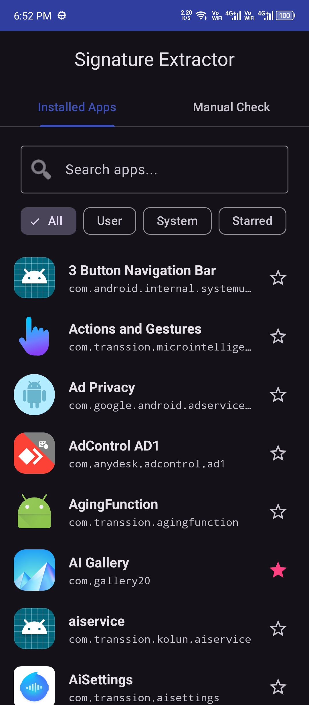
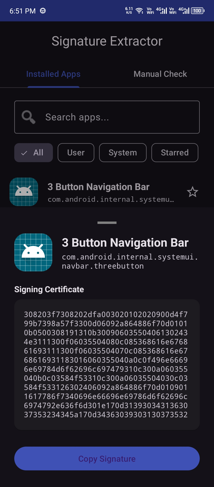
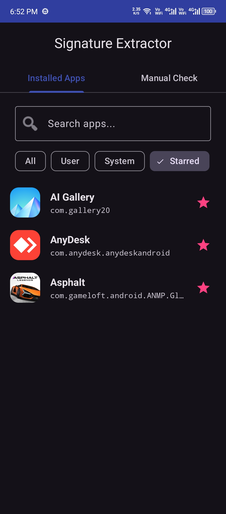
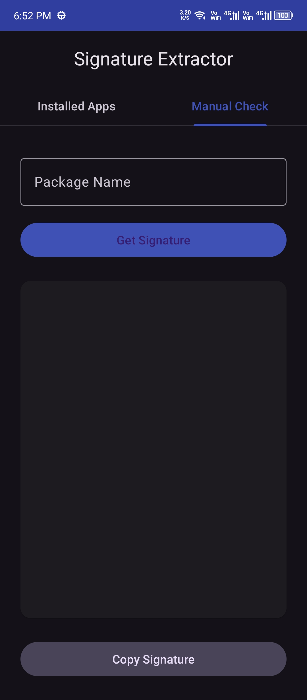

  

<h1 align="center">Signature Extractor</h1>

  
  
  
  

An Android utility designed to query, find, and extract application signing signatures (SHA/Certificates) on Android devices.

## Features
- **App Catalog Auto-Discovery:** Instantly queries and lists all installed user and system applications with their icons, names, and package IDs.
- **Search & Smart Filtering:** Quickly filter apps by name/package, and toggle between user apps, system apps, or your starred favorites.
- **Quick Bookmarks (Starring):** Star frequently-checked apps to save them for quick access.
- **Context-Aware Bottom Sheets:** Tap any app to bring up a bottom sheet with its signing certificate and a one-tap copy button.
- **Classic Manual Check:** A dedicated fallback tab allowing developers to manually type or paste any arbitrary package name.
- **Reliable Data Retrieval:** Accesses public certificates across all Android signing schemes.
- **Clean Material 3 Interface:** Adaptive layout with full dark mode and dynamic theming compatibility.

## Screenshots

| 📱 Installed Apps List | 🔍 Signature Bottom Sheet |
| --- | --- |
|  |  |

| ⭐ Starred Favorites | ⌨️ Classic Manual Check |
| --- | --- |
|  |  |

## Technical Specifications
- Minimum SDK: 23 (Android 6.0)
- Target SDK: 35 (Android 15)
- Language: Java
- UI Library: AndroidX / Google Material Components

## Author
Developed by Farhan Ali
